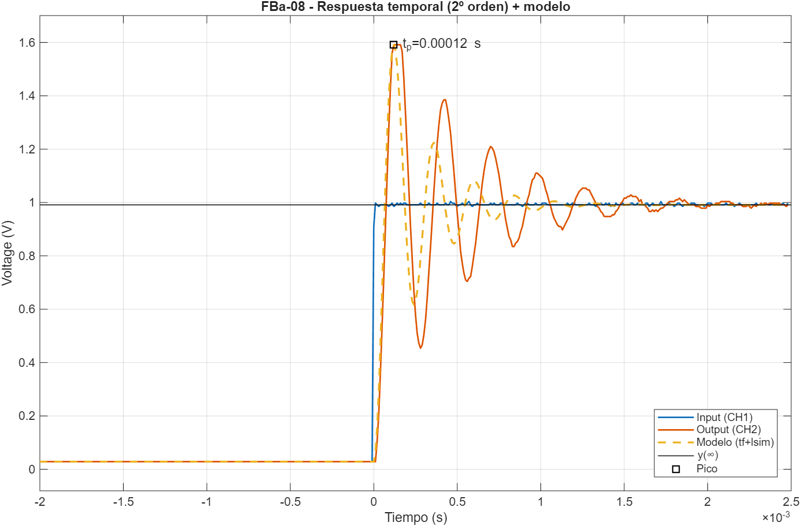
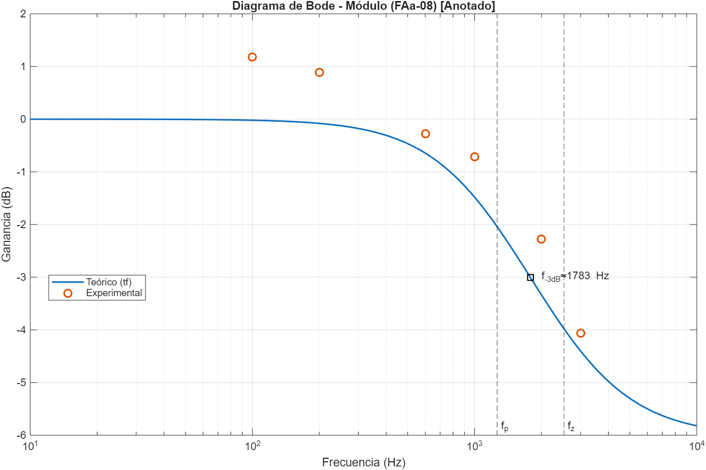
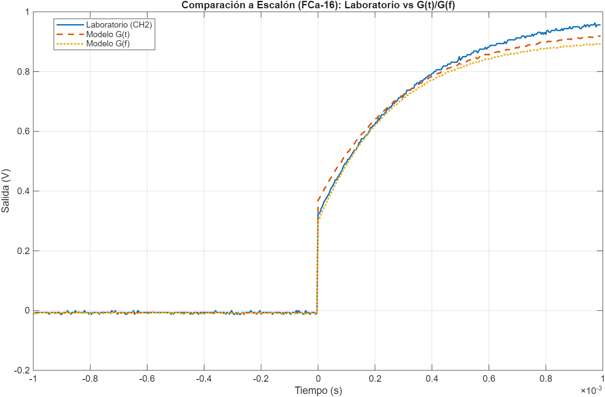

<div align="center">

# Control Systems and Automation

**MATLAB laboratory work for Industrial Automation — System Identification & Control Analysis**

[](#) [](README.es.md)


</div>

Hands-on **MATLAB** laboratory exercises for the *Industrial Automation* course at **UNED** (Universidad Nacional de Educación a Distancia). Every practice identifies the transfer function of a real analog system from measured step responses and frequency captures, then validates the model against the data.

## Overview

Each lab folder contains the **measured data** (oscilloscope captures), the **MATLAB scripts** that perform the identification, and the **figures** (`.fig` + `.png`) used in the written report.

| Experiment | System under test | What is done |
|---|---|---|
| **FAa-08** | First-order system with a zero (lead network) `G(s) = K(1+Ts)/(1+τs)` | Time constant `τ` and zero time `T` from step response; Bode magnitude/phase vs experimental points; gain & phase margins; fitting of a time-domain model `G(t)` vs a frequency-fitted model `G(f)` |
| **FBa-08** | Underdamped second-order system `G(s) = K·ωₙ²/(s²+2ζωₙs+ωₙ²)` | Step-response specs (`Mp`, `t_p`, `t_d`, `t_r`, `t_s`, `ζ`, `ω_d`, `ω_n`); resonance peak `fr`/`Mr`; annotated Bode diagrams; `G(t)` vs `G(f)` comparison |
| **FCa-16** | Underdamped second-order system | Same full workflow applied to a second dataset |

> The `G(t)` vs `G(f)` scripts build two models per system: one identified from the **time domain** (step response) and one fitted in the **frequency domain** (least squares on the magnitude in dB), and compare both against the laboratory measurements.

### Preview

| Step response & model fit | Annotated Bode (magnitude) | Step comparison `G(t)`/`G(f)` |
|---|---|---|
|  |  |  |

## Repository Structure

```text
.
├── README.md                              # This file
├── README.es.md                           # Spanish version
├── docs/
│   └── Guion_Practicas_AI.pdf             # Course assignment guide
├── practices/
│   ├── FAa-08/
│   │   ├── code/                          # MATLAB scripts (.m)
│   │   ├── data/                          # Oscilloscope captures (.csv)
│   │   └── figures/                       # Plots (.fig and .png)
│   ├── FBa-08/
│   │   └── ...
│   └── FCa-16/
│       └── ...
└── report/
    ├── AI-Soriano_Palacios_Maria.pdf      # Full written report (PDF)
    └── AI-Soriano_Palacios_Maria.docx     # Report source (Word)
```

Each practice folder follows the same layout:

```text
FAa-08/
├── code/      # FAa08_MATLAB.m  +  FAa08_MATLAB_ComparacionFinal.m
├── data/      # FAa-08_Waveform.csv  (time, CH1 input, CH2 output)
└── figures/   # Bode (module & phase), step response, tau & resonance
```

## Getting Started

### Requirements

- **MATLAB** (R2019b or newer) with the **Control System Toolbox** (`tf`, `bode`, `margin`, `lsim`).
- The waveform `.csv` files (already in `data/`).

### Running the scripts

1. Open `code/` in MATLAB and add `data/` to the path (or run from a folder that contains both — the scripts read the `.csv` by file name).
2. Run the main script, e.g. `FAa08_MATLAB.m`, then the final-figures script `FAa08_MATLAB_ComparacionFinal.m`.
3. The identified parameters and stability margins are printed to the Command Window.

```matlab
% Example: FAa-08 (first-order system with a zero)
run FAa08_MATLAB.m
```

## Concepts Covered

- Transfer functions and Laplace-domain modeling
- Frequency response: Bode magnitude & phase diagrams
- Phase and gain margins, stability analysis
- System identification from a step response (time-constant extraction, overshoot/zeta)
- Second-order dynamics: `ζ`, `ωₙ`, rise/settling times, resonance `Mr`
- Model validation: time-domain model vs frequency-domain fit
- Industrial automation fundamentals

## Skills Developed

- MATLAB scripting and the Control System Toolbox
- Mathematical modeling of real systems measured on hardware
- Simulation-based engineering validation
- Quantitative analysis of stability and dynamic performance

## About

Developed by **María Soriano Palacios** as part of the **Industrial Electronics and Automation Engineering** microdegree at UNED. The scripts retain Spanish comments and notation, matching the course language.

*Academic work made available as a portfolio of control-systems and automation skills.*